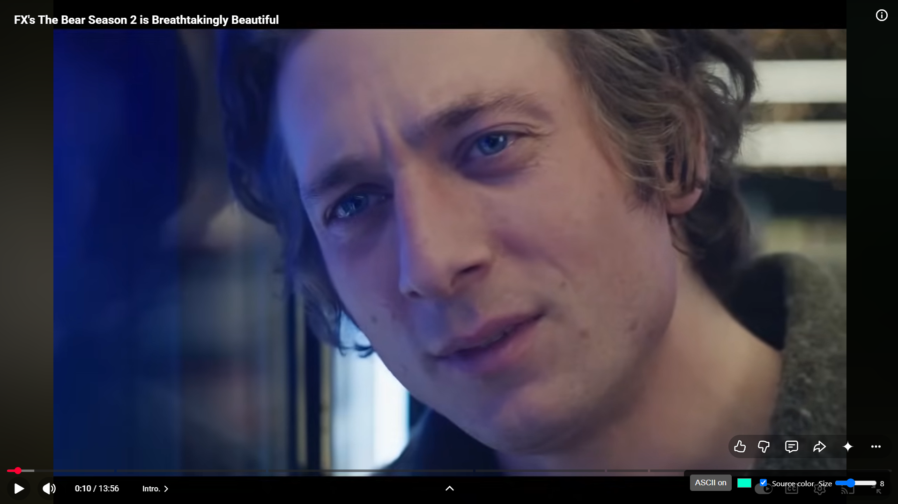
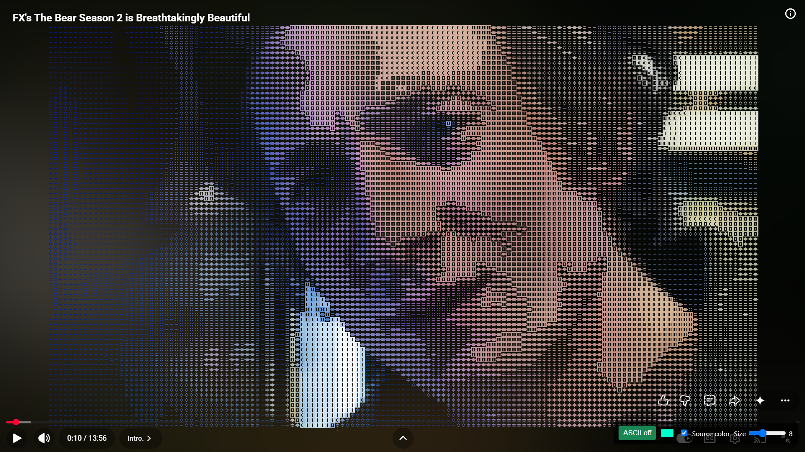
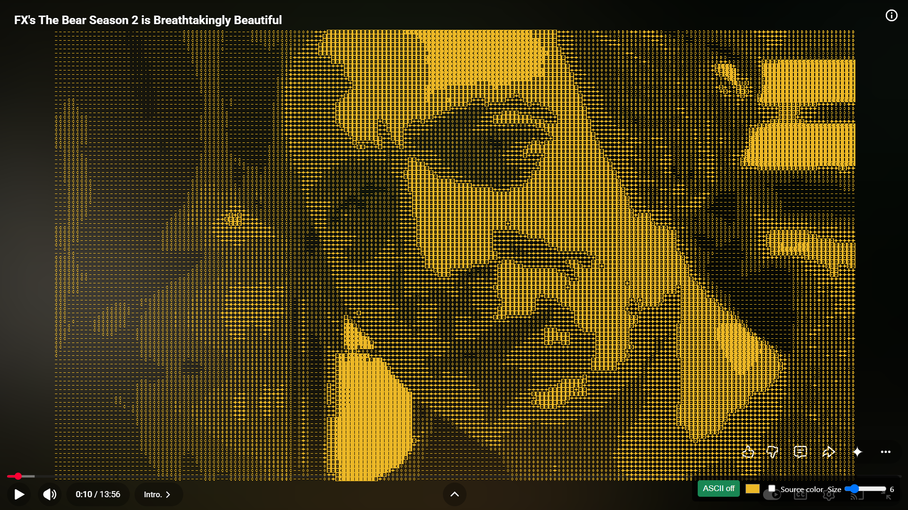

# ASCII art creator

Create live ASCII art from your webcam or uploaded images, and use the browser extension to watch any webpage video as ASCII.

## Demo

Original frame:



ASCII with tint color:



ASCII with source color:



Sample clip: [video.mp4](video.mp4)

## Web app

Requires a browser with WebGPU (Chrome/Edge).

```bash
npm install
npm run dev
```

Open the local URL Vite prints (usually `http://localhost:5173`).

- Allow camera access for live ASCII
- Or upload an image with the file control
- Toggle **Use source color** / pick a tint color

Other scripts:

```bash
npm run build
npm run preview
```

## Browser extension

The `extension/` folder is a Manifest V3 Chromium extension that overlays ASCII on the largest visible `<video>` on a page (YouTube and other sites; works in iframes too).

### Install

1. Open `chrome://extensions` or `edge://extensions`
2. Enable **Developer mode**
3. Choose **Load unpacked**
4. Select the `extension` directory
5. Open a page with a video, start playback, click **ASCII on**

### Controls

- **ASCII on/off** — toggle the overlay
- Color swatch — tint when source color is off
- **Source color** — color glyphs from the video
- **Size** — ASCII cell size (1–16)

If a stream is cross-origin without CORS, the panel shows that the video can’t be read. Reload the extension after code changes, then hard-refresh the page.
